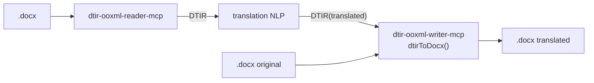

[日本語](./README.md) | **English**

# @shuji-bonji/dtir-ooxml-writer-mcp

An MCP server that produces a translated `.docx` from a translated **DTIR** + the original `.docx`. The counterpart of `dtir-ooxml-reader-mcp`.



## Design

- **Patch the original file by id.** Locate the paragraph via `anchor.ref.path` and inject the translation.
- It only rewrites segments where `translatable=true` and `translation!=null`.
- **Untouchable**: `translatable=false` (fields/numerics/empty) and elements that never enter the IR
  (`sectPr` / DrawingML images / formatting) are never touched = **cannot break by construction**.
- v0.1 uses **collapse**: the translation goes into the first text run's `w:t` and the remaining `w:t` are emptied
  (intra-paragraph formatting is discarded). Preserving intra-paragraph formatting comes in v0.2 using `text.runs`.

> **replace-by-id is a generic seam.** Today it patches text parts, but the same framework can later add
> swapping of binary media parts (DeepL image-translation beta). Extensible without changing the contract.

## Usage

MCP tool `dtir_to_docx`:

```jsonc
{ "dtirJson": "<translated DTIR>", "originalDocxBase64": "<original .docx base64>",
  "onMissingTranslation": "keep" }   // → { fileName, byteSize, docxBase64 }
```

Library:

```ts
import { dtirToDocx } from '@shuji-bonji/dtir-ooxml-writer-mcp/writer';
const out = await dtirToDocx(translatedDtir, originalBuf, { onMissingTranslation: 'keep' });
```

## Connecting as an MCP server

Build (place `doc-translation-ir` next to it **at build time only**; type-only dependency, not needed at runtime):

```sh
git clone https://github.com/shuji-bonji/doc-translation-ir.git
git clone https://github.com/shuji-bonji/dtir-ooxml-writer-mcp.git
cd dtir-ooxml-writer-mcp && npm install   # `prepare` auto-builds → dist/index.js (rebuild with npm run build)
```

### Claude Desktop (`claude_desktop_config.json`)

```jsonc
{
  "mcpServers": {
    "dtir-ooxml-writer": {
      "command": "node",
      "args": ["/ABS/PATH/dtir-ooxml-writer-mcp/dist/index.js"]
    }
  }
}
```

### Claude Code

```sh
claude mcp add dtir-ooxml-writer -- node /ABS/PATH/dtir-ooxml-writer-mcp/dist/index.js
```

Provided tool: **`dtir_to_docx`** (translated DTIR + original docx → translated docx)

## Tests

- `npm test` — vitest (the main invariants)
- `npm run test:roundtrip` — an acceptance test that takes the bundled static DTIR fixture (reader output) as input:
  pseudo-translate → writer → (translation injected / fields, numerics, sectPr untouched / collapse /
  **pdf conversion via LibreOffice = Word compatibility**). The real reader↔writer round-trip lives in `dtir-docx-pipeline`.

## PoC notes

The DTIR type depends on `@shuji-bonji/doc-translation-ir` (the shared contract).
