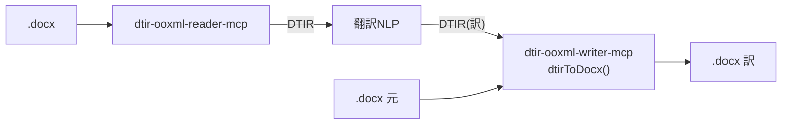

**日本語** | [English](./README.en.md)

# @shuji-bonji/dtir-ooxml-writer-mcp

翻訳済み **DTIR** ＋ 元 `.docx` から訳 `.docx` を生成する MCP サーバ。`dtir-ooxml-reader-mcp` と対。



## 設計

- **元ファイルを基板に id でパッチ**。`anchor.ref.path` で段落を特定し、訳文を注入。
- 書き換えるのは `translatable=true` かつ `translation!=null` のセグメントのみ。
- **不可触**: `translatable=false`（フィールド/数値/空）と、IR に乗らない要素
  （`sectPr` / DrawingML 画像 / 書式）は一切触らない＝**原理的に崩れない**。
- v0.1 は **collapse**: 訳文を先頭テキストランの `w:t` に入れ、残りの `w:t` を空にする
  （段内書式は捨てる）。段内書式保持は `text.runs` を使う v0.2 で対応。

> **replace-by-id は汎用の継ぎ目**。現状はテキスト part のパッチだが、同じ枠組みで将来
> バイナリ media part の差し替え（DeepL 画像翻訳 beta）を足せる。契約は変えずに拡張可能。

## 使い方

MCP tool `dtir_to_docx`:

```jsonc
{ "dtirJson": "<翻訳済み DTIR>", "originalDocxBase64": "<元 .docx base64>",
  "onMissingTranslation": "keep" }   // → { fileName, byteSize, docxBase64 }
```

ライブラリ:

```ts
import { dtirToDocx } from '@shuji-bonji/dtir-ooxml-writer-mcp/writer';
const out = await dtirToDocx(translatedDtir, originalBuf, { onMissingTranslation: 'keep' });
```

## MCP サーバとして接続

ビルド（**build 時だけ** `doc-translation-ir` を隣に置く。実行時は型のみ依存で不要）:

```sh
git clone https://github.com/shuji-bonji/doc-translation-ir.git
git clone https://github.com/shuji-bonji/dtir-ooxml-writer-mcp.git
cd dtir-ooxml-writer-mcp && npm install   # prepare で自動ビルド → dist/index.js（再ビルドは npm run build）
```

### Claude Desktop（`claude_desktop_config.json`）

```jsonc
{
  "mcpServers": {
    "dtir-ooxml-writer": {
      "command": "node",
      "args": ["/ABS/PATH/dtir-ooxml-writer-mcp/dist/index.js"]
    }
  }
}
```

### Claude Code

```sh
claude mcp add dtir-ooxml-writer -- node /ABS/PATH/dtir-ooxml-writer-mcp/dist/index.js
```

提供ツール: **`dtir_to_docx`**（翻訳済み DTIR ＋ 元 docx → 訳 docx）

## テスト

- `npm test` — vitest（主要不変条件）
- `npm run test:roundtrip` — 同梱の静的 DTIR フィクスチャ（reader 出力）を入力にした受け入れテスト:
  擬似翻訳→writer→（訳文注入 / フィールド・数値・sectPr 不可触 / collapse /
  **LibreOffice で pdf 化＝Word 互換**）。reader↔writer の本物往復は `dtir-docx-pipeline`。

## PoC の注意

DTIR 型は `@shuji-bonji/doc-translation-ir` に依存（共有契約）。
